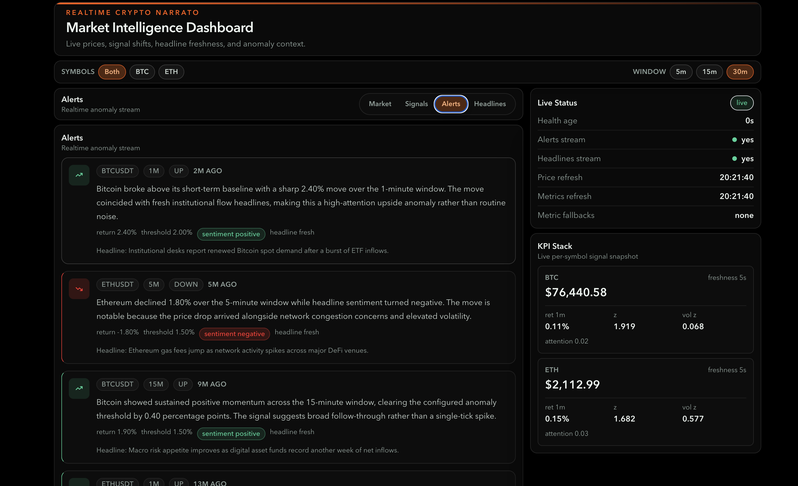
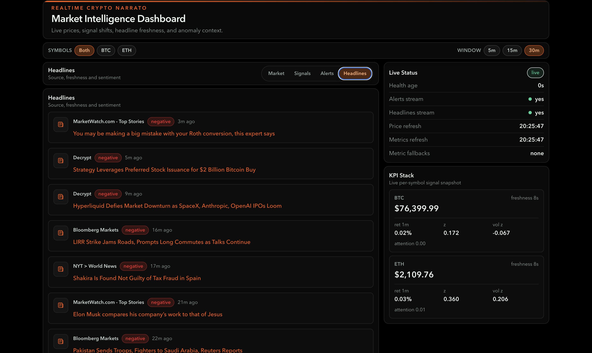
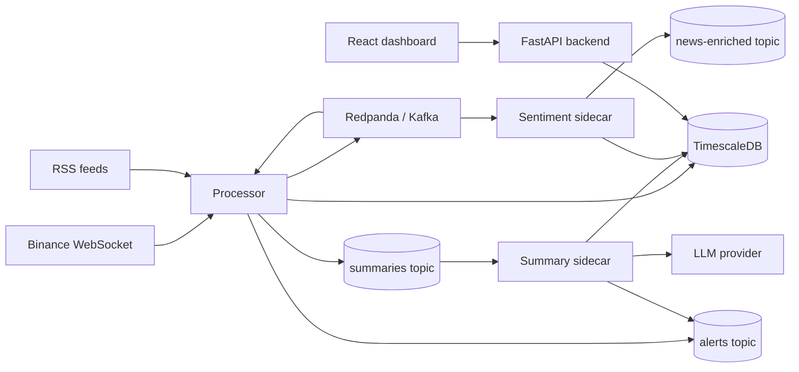

# Real-Time Crypto Intelligence Pipeline

A real-time event-driven system that ingests crypto market prices and news, computes rolling market signals, detects abnormal movement, enriches events with sentiment and LLM-generated summaries, and exposes live alerts through a FastAPI backend and React dashboard.

The project is built to show backend and streaming-systems engineering: async ingestion, Kafka-style event flow, time-series persistence, anomaly detection, sidecar enrichment, recovery tooling, and operational APIs.

## Screenshots

Dashboard overview:

<!-- Add screenshot here: docs/assets/dashboard-overview.png -->

```md

```

Alerts feed:

<!-- Add screenshot here: docs/assets/alerts-feed.png -->

```md

```

Headlines feed:

<!-- Add screenshot here: docs/assets/headlines-feed.png -->

```md

```

## Why I built this

This project is meant to demonstrate practical backend engineering around real-time data systems:

- Ingesting external live data streams.
- Moving events through Kafka-compatible topics.
- Persisting time-series data in TimescaleDB.
- Computing rolling-window metrics and anomaly signals.
- Keeping expensive AI work out of the hot path through sidecars.
- Handling bad messages, retries, stale data, and replay workflows.
- Exposing the pipeline through a small operational frontend.

## What it does

- Streams live Binance price ticks for BTC and ETH.
- Polls RSS feeds and converts headlines into news events.
- Publishes price, news, alert, summary, and enrichment events through Redpanda/Kafka.
- Stores prices, metrics, headlines, and anomalies in TimescaleDB.
- Computes rolling returns, volatility, z-scores, percentiles, and attention metrics.
- Detects unusual market movement and persists anomaly records.
- Uses a summary sidecar to generate LLM-backed anomaly summaries asynchronously.
- Uses a sentiment sidecar to enrich news/headline sentiment.
- Exposes REST and SSE endpoints through FastAPI.
- Renders an operational React dashboard for prices, signals, alerts, headlines, KPIs, and stream health.

## System walkthrough

1. The processor connects to Binance WebSocket and receives live price ticks.
2. RSS feeds are fetched and converted into news messages.
3. Price and news events are published into Redpanda/Kafka topics.
4. Price events are consumed by the processor and stored in TimescaleDB.
5. The metrics/anomaly modules calculate rolling signals and detect unusual movement.
6. Detected anomalies are written to the `anomalies` table.
7. Anomaly events are also published to Kafka for downstream processing.
8. The summary sidecar consumes anomaly summary jobs and generates LLM summaries.
9. The sentiment sidecar consumes news events and enriches headlines with model sentiment.
10. The backend exposes REST and SSE endpoints so the frontend can show live prices, headlines, and alerts.

## Architecture



Deeper architecture notes live in:

- [`docs/architecture.md`](docs/architecture.md)
- [`docs/processor.md`](docs/processor.md)
- [`docs/backend.md`](docs/backend.md)
- [`docs/frontend.md`](docs/frontend.md)

## Data flow

Price path:

```text
Binance WebSocket -> prices topic -> processor consumer -> TimescaleDB prices/metrics -> anomaly detector -> anomalies table -> alerts topic -> frontend
```

News path:

```text
RSS feeds -> news topic -> headlines table -> sentiment sidecar -> enriched headline sentiment -> frontend
```

Summary path:

```text
Anomaly detected -> summaries topic -> summary sidecar -> LLM summary -> anomalies table update -> frontend
```

## Reliability features

- Retry and backoff around DB/Kafka operations.
- Reconnect/backoff behavior for external ingest loops.
- Dead-letter topics for failed price, news, and summary messages.
- Local DLQ buffer fallback for failed summary DLQ writes.
- Deterministic anomaly probe for validating the alert path.
- Runtime verification script for processor/sidecar deployment safety.
- Replay script for failed summary jobs.
- Graceful task cancellation and health checks.
- Structured counters and logs for anomaly decisions and ingest health.

## Tech stack

- **Processor:** Python async services, aiokafka, asyncpg, websockets, feedparser.
- **Streaming:** Redpanda/Kafka-compatible topics.
- **Database:** TimescaleDB/Postgres.
- **Backend:** FastAPI, asyncpg, REST + SSE endpoints.
- **AI sidecars:** LLM summary sidecar, ONNX/default sentiment sidecar with fallback behavior.
- **Frontend:** React, Vite, TypeScript, Tailwind CSS, TanStack Query, Recharts.
- **Infra:** Docker Compose, Makefile runbooks, migration/replay/verification scripts.
- **Tests:** pytest, pytest-asyncio, Vitest, React Testing Library.

## Repository layout

```text
backend/      FastAPI read API over TimescaleDB
processor/    streaming ingest, metrics, anomaly detection, sidecars
frontend/     React operational dashboard
infra/        Docker Compose, schema, environment template
scripts/      migrations, probes, replay and verification tools
docs/         architecture, service, and test cheat sheets
models/       local model assets, e.g. FinBERT ONNX files
```

## Running locally

Create an environment file:

```bash
cp infra/.env.example infra/.env
```

Run database migrations:

```bash
make migrate-db
```

Start the full stack:

```bash
cd infra
docker compose --env-file .env up -d redpanda timescaledb redis backend processor summary-sidecar sentiment-sidecar frontend
```

Open:

- Frontend: `http://localhost:3000`
- Backend health: `http://localhost:8000/health`

Useful runtime checks:

```bash
curl http://localhost:8000/health
curl 'http://localhost:8000/alerts?limit=5'
curl 'http://localhost:8000/headlines?limit=5'
```

## Configuration notes

Important environment values are documented in [`infra/.env.example`](infra/.env.example).

Defaults worth knowing:

- `SYMBOLS=btcusdt,ethusdt`
- `NEWS_RSS=https://www.coindesk.com/arc/outboundfeeds/rss/`
- `LLM_PROVIDER=stub`
- `SENTIMENT_PROVIDER=onnx`
- `SENTIMENT_FAIL_FAST=false`
- `ANOMALY_TEST_MODE=false`

The summary sidecar does not block the anomaly hot path. Alerts can appear with `summary: null`; the frontend shows `summarizing...` until the sidecar backfills the summary.

## Testing

Backend tests:

```bash
cd backend
PYTHONPATH=.. .venv/bin/python -m pytest tests_unit tests_integration
```

Processor tests:

```bash
python3 -m pytest -q processor/tests
```

Processor smoke test:

```bash
make smoke-test
```

Frontend tests:

```bash
cd frontend
npm run test
npm run build
npm run lint
```

Test documentation:

- [`docs/backend_tests.md`](docs/backend_tests.md)
- [`docs/processor_tests.md`](docs/processor_tests.md)
- [`docs/frontend_testing_plan.md`](docs/frontend_testing_plan.md)

## Operational scripts

Database migration:

```bash
make migrate-db
```

Rebuild processor and summary sidecar:

```bash
make deploy-processor
```

Verify runtime source/build alignment:

```bash
make verify-runtime
```

Probe anomaly path:

```bash
PYTHONPATH=processor/src:. .venv/bin/python scripts/probe_anomaly_path.py --check-summaries
```

Replay failed summary jobs:

```bash
make replay-summaries-dlq
```

## Known limitations

- This is not a trading system and does not place orders.
- No schema registry yet; JSON payload contracts are enforced through code and tests.
- LLM summaries are asynchronous and may lag behind newly emitted alerts.
- Sentiment enrichment depends on local model assets unless fallback behavior is used.
- Frontend tests are intentionally lean and do not cover visual snapshots or chart internals.
- Recharts visualization is operational, not a full financial charting terminal.
- Runtime defaults are development-oriented; production deployment would need stronger secrets, monitoring, and retention policies.

## Future improvements

- Add a schema registry or stronger versioned event contracts.
- Add richer observability dashboards for processor and sidecar metrics.
- Add more realistic anomaly scoring beyond static thresholds and rolling z-scores.
- Add historical replay/backfill workflows for prices and news.
- Add lightweight end-to-end browser coverage if frontend workflows grow.
- Improve production deployment posture: secrets, TLS, retention, backups, and alerting.

## Documentation

- [`docs/architecture.md`](docs/architecture.md): source-of-truth architecture and diagrams.
- [`docs/processor.md`](docs/processor.md): processor and sidecar cheat sheet.
- [`docs/backend.md`](docs/backend.md): backend API cheat sheet.
- [`docs/frontend.md`](docs/frontend.md): frontend dashboard cheat sheet.
- [`docs/math.md`](docs/math.md): metrics and anomaly math notes.
- [`docs/anomaly_diagnostics.md`](docs/anomaly_diagnostics.md): anomaly path diagnostics.
