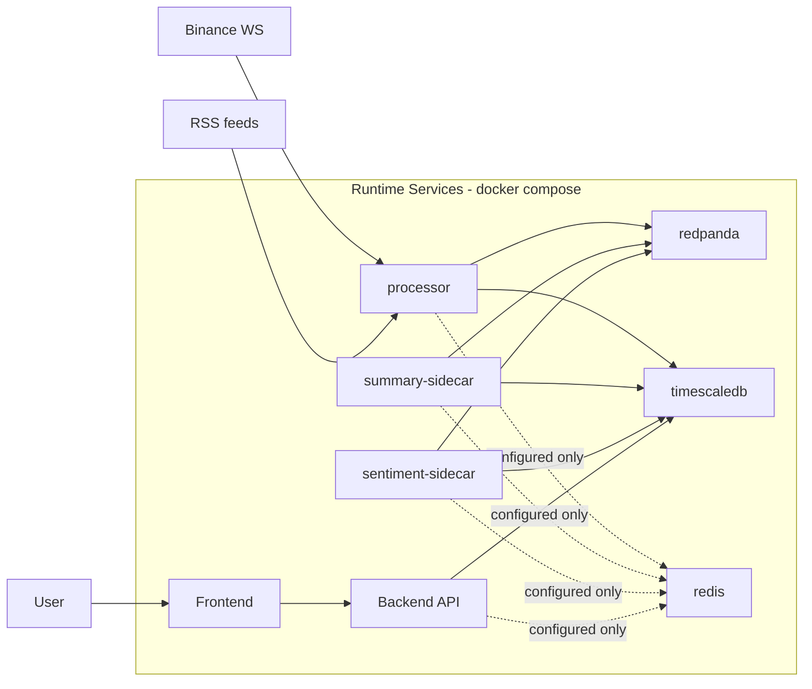
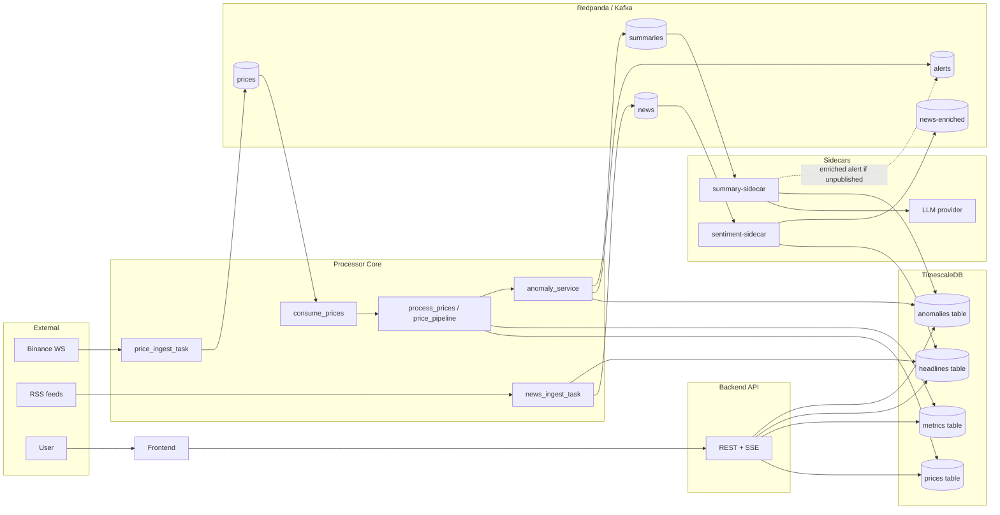
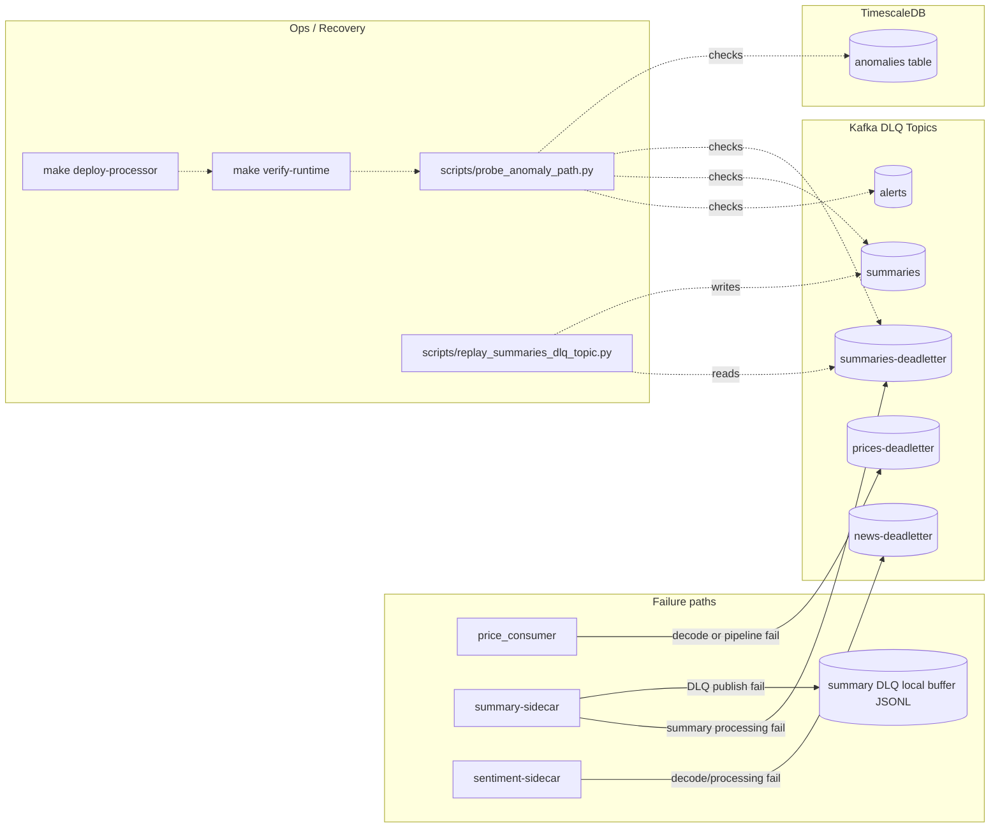

# Architecture (Source of Truth)

This document is the architecture source of truth for the current pipeline.  
It is based only on code/config references listed below (no inferred or future-state edges).

## Source Files Used
- `infra/docker-compose.yml`
- `processor/src/streaming_core.py`
- `processor/src/services/ingest.py`
- `processor/src/services/price_consumer.py`
- `processor/src/services/price_pipeline.py`
- `processor/src/services/anomaly_service.py`
- `processor/src/services/summary_sidecar.py`
- `processor/src/services/sentiment_sidecar.py`
- `processor/src/services/sidecar_runtime.py`
- `processor/src/metrics_http.py`
- `processor/src/io/db.py`
- `processor/src/io/models/messages.py`
- `processor/src/config.py`
- `backend/app/main.py`
- `backend/app/diagnostics.py`
- `backend/app/db.py`
- `backend/app/streams.py`
- `frontend/src/features/dashboard/use-dashboard-data.ts`
- `scripts/migrate_db.py`
- `scripts/verify_runtime_build.py`
- `scripts/probe_anomaly_path.py`
- `scripts/replay_summaries_dlq_topic.py`
- `Makefile`

## Legend
- Solid arrow: active runtime data flow
- Dashed arrow: configured/optional or non-hot-path dependency
- Dotted arrow: ops/recovery flow
- `[(...)]`: Kafka topic or DB table
- `[ ... ]`: service/component

Note on naming: DB uses `window_name` while Kafka/messages use `window`.

## Diagram A — Container / Runtime Topology

## Diagram B — Happy-Path Dataflow

## Diagram C — Failure / Recovery Paths

## Schema Notes
- Current DB migration source is `scripts/migrate_db.py`.
- `infra/schema.sql` is kept as a manual SQL snapshot and should stay aligned with `scripts/migrate_db.py`.
- `anomalies` includes `alert_published BOOLEAN DEFAULT TRUE` for alert publish idempotency.
- DB column `window_name` maps to Kafka/API field `window`; DB column `return_value` maps to Kafka/API field `ret` or `return`.

## Alert Publish Idempotency
The anomaly and summary paths share the `anomalies.alert_published` flag to avoid duplicate alert publication.

1. The processor detects an anomaly and inserts an `anomalies` row with `alert_published=false`.
2. The processor publishes a summary request to `summaries`.
3. The processor publishes the pending alert to `alerts` with `summary=null`.
4. After successful alert publish, the processor marks `alert_published=true`.
5. The summary sidecar consumes `summaries`, generates a summary, and backfills `anomalies.summary`.
6. The summary sidecar only publishes an enriched alert if `alert_published=false`; otherwise it skips republishing and only keeps the DB summary update.

## Frontend Boundary
The frontend reads backend REST/SSE endpoints through feature hooks. `useDashboardData` adapts those hook results into stable dashboard props, and the dashboard panels/charts render from those props. Processor-derived logic stays in the backend/processor path, not in the UI.

## Observability
- Backend `GET /diagnostics/pipeline` reports DB-backed freshness, recent row counts, and `ok` / `degraded` / `stale` / `down` status without inspecting Kafka directly.
- `processor` can expose JSON runtime metrics through the processor metrics HTTP server.
- `summary-sidecar` can expose JSON summary-sidecar metrics when `SUMMARY_METRICS_PORT` is configured.
- `sentiment-sidecar` can expose JSON sentiment-sidecar metrics when `SENTIMENT_METRICS_PORT` is configured.
- Processor and sidecar Docker logs render structured `fields={...}` metadata for traceability, including `event_id`, `symbol`, `window`, `topic`, `operation`, offsets, and error metadata.
- Prometheus, Grafana, OpenTelemetry, and a frontend observability dashboard are not part of the current runtime.

## Edge-to-Source Index
| Edge | Producer/Writer | Consumer/Reader | Source refs |
|---|---|---|---|
| Compose runtime services | `docker-compose` service graph | containers | `infra/docker-compose.yml` |
| DB schema and optional retention | `scripts/migrate_db.py` | TimescaleDB | `scripts/migrate_db.py`, `processor/src/config.py` |
| Processor starts ingest/consume tasks | `StreamProcessor.start()` | `price_ingest_task`, `news_ingest_task`, `process_prices_task` | `processor/src/streaming_core.py` |
| Binance WS -> `prices` topic | `price_ingest_task` | Kafka `prices` | `processor/src/services/ingest.py` |
| RSS -> `news` topic | `news_ingest_task` | Kafka `news` | `processor/src/services/ingest.py`, `processor/src/io/models/messages.py` |
| RSS -> `headlines` table | `publish_news_msg` via `insert_headline` | Timescale `headlines` | `processor/src/services/ingest.py`, `processor/src/io/db.py` |
| `prices` topic -> consumer loop | `AIOKafkaConsumer(settings.price_topic)` | `consume_prices` | `processor/src/streaming_core.py`, `processor/src/services/price_consumer.py` |
| price message parse/pipeline fail -> `prices-deadletter` | `price_consumer` via `send_price_dlq` | Kafka `prices-deadletter` | `processor/src/services/price_consumer.py`, `processor/src/streaming_core.py` |
| Price -> `prices` table | `insert_price` | Timescale `prices` | `processor/src/services/price_pipeline.py`, `processor/src/io/db.py` |
| Metrics -> `metrics` table | `insert_metric` | Timescale `metrics` | `processor/src/services/price_pipeline.py`, `processor/src/io/db.py` |
| Pipeline -> anomaly detection | `persist_and_publish_price` | `check_anomalies` | `processor/src/services/price_pipeline.py`, `processor/src/services/anomaly_service.py` |
| Anomaly persist -> `anomalies` table | `insert_anomaly` | Timescale `anomalies` | `processor/src/services/anomaly_service.py`, `processor/src/io/db.py` |
| Anomaly publish -> `summaries` topic | `anomaly_service` | `summary-sidecar` | `processor/src/services/anomaly_service.py`, `processor/src/services/summary_sidecar.py` |
| Anomaly publish -> `alerts` topic | `anomaly_service` | downstream consumers/UI | `processor/src/services/anomaly_service.py` |
| Alert publish marker | `mark_anomaly_alert_published` | `anomaly_service`, `summary-sidecar` | `processor/src/io/db.py`, `processor/src/services/anomaly_service.py`, `processor/src/services/summary_sidecar.py` |
| `summaries` -> LLM -> anomalies summary | `summary-sidecar` + `compute_summary` + `persist_summary` | Timescale `anomalies.summary` | `processor/src/services/summary_sidecar.py`, `processor/src/llm.py` |
| conditional enriched alert -> `alerts` | `summary-sidecar` when `alert_published=false` | Kafka `alerts` | `processor/src/services/summary_sidecar.py`, `processor/src/io/db.py` |
| summary processing fail -> `summaries-deadletter` | `summary-sidecar` | Kafka `summaries-deadletter` | `processor/src/services/summary_sidecar.py` |
| summary DLQ publish fail -> local JSONL buffer | `_append_summary_dlq_buffer` | local file | `processor/src/services/summary_sidecar.py` |
| `news` topic -> sentiment sidecar | `AIOKafkaConsumer(settings.news_topic)` | sentiment loop | `processor/src/services/sentiment_sidecar.py` |
| sentiment upsert -> `headlines` table | `_upsert_headline` | Timescale `headlines` | `processor/src/services/sentiment_sidecar.py`, `processor/src/io/db.py` |
| sentiment publish -> `news-enriched` topic | `send_enriched_news` | Kafka `news-enriched` | `processor/src/services/sentiment_sidecar.py`, `processor/src/io/models/messages.py` |
| sentiment failures -> `news-deadletter` | `_send_dlq` | Kafka `news-deadletter` | `processor/src/services/sentiment_sidecar.py` |
| Backend reads `prices` | `fetch_prices` | `/prices` | `backend/app/db.py`, `backend/app/main.py` |
| Backend reads `metrics` | `fetch_latest_metrics` | `/metrics/latest` | `backend/app/db.py`, `backend/app/main.py` |
| Backend reads `headlines` | `fetch_headlines` | `/headlines` + `/headlines/stream` | `backend/app/db.py`, `backend/app/main.py`, `backend/app/streams.py` |
| Backend reads `anomalies` | `fetch_alerts` | `/alerts` + `/alerts/stream` | `backend/app/db.py`, `backend/app/main.py`, `backend/app/streams.py` |
| Backend diagnostics | diagnostics DB helpers | `/diagnostics/pipeline` | `backend/app/db.py`, `backend/app/diagnostics.py`, `backend/app/main.py` |
| Frontend data orchestration | feature hooks | dashboard panels/charts | `frontend/src/features/dashboard/use-dashboard-data.ts`, `frontend/src/features/dashboard/` |
| Runtime metrics HTTP | metrics handlers | optional HTTP listeners | `processor/src/metrics_http.py`, `processor/src/streaming_core.py`, `processor/src/services/summary_sidecar.py`, `processor/src/services/sentiment_sidecar.py` |
| Runtime verify gate | `make verify-runtime` + script | checks running summary-sidecar source signature | `Makefile`, `scripts/verify_runtime_build.py` |
| Probe gate | `probe_anomaly_path.py` publishes/consumes/checks | validates `alerts`/`summaries`/`summaries-deadletter`/`anomalies` | `scripts/probe_anomaly_path.py` |
| Replay flow | `replay_summaries_dlq_topic.py` | `summaries-deadletter` -> `summaries` | `scripts/replay_summaries_dlq_topic.py`, `Makefile` |
| Redis status | configured only (`redis_url`, compose service) | no active runtime usage in processor/backend flow | `infra/docker-compose.yml`, `processor/src/config.py` |

## Quick Sanity Checks
- Topics and tables in the diagrams match current runtime (`prices/news/news-enriched/summaries/alerts` + DLQs, and `prices/metrics/headlines/anomalies`).
- `anomalies.alert_published` is represented as the alert publish idempotency guard.
- Sidecar wiring is correct: summary-sidecar consumes `summaries`; sentiment-sidecar consumes `news`.
- Backend stream coverage is explicit: `/headlines/stream` and `/alerts/stream` are represented as DB-polled SSE.
